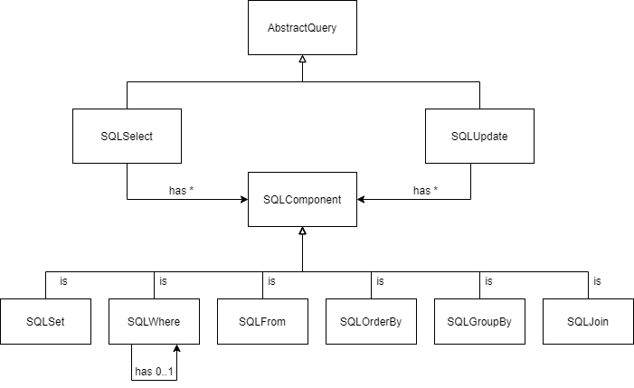

# Internal DSL - SQL Query Generator

This project showcases an internal domain specific language written in C# for creating SQL queries for SQL Server databases. 

## Metamodel
Instances of the metamodel represent SQL queries and inherit from the AbstractSQLQuery class. The current implementation allows SELECT and UPDATE statements to be created. An instance of a given statement contains instances of the SQLComponent inteface which define clauses of the SQL query such as from, where, join, etc.

Instances of SQLWhere can be nested within each other allowing for longer WHERE clauses to be created. 



The DSL creates SQL queries, which can be executed on appropriate databases. The current example program allows for connecting to SQL Server databases. 

## Code Example

The structure of the DSL is as follows:
```C#
var builder = new SQLQueryBuilder();
var selectQuery = builder.
                    Select("students.name", "age", "major","course", "grade").
                    Distinct().
                    From("students").
                    InnerJoin("grades",("students.name","grades.name")).
                    Where("students.name", "grades.name").AND("students.name", "Markus").
                    OrderBy("students.name").
                    FinishQuery();
```
and produces the following query (will be refered to as'Query-1'):

```SQL
SELECT DISTINCT students.name,age,major,course,grade 
FROM students 
INNER JOIN grades ON (students.name = grades.name) 
WHERE students.name = grades.name AND students.name = 'Markus' 
ORDER BY students.name
```

The test database is depicted here:


And Query-1 produces the following result:

```
Markus,23,Software Engineering,Algebra,7
Markus,23,Software Engineering,Math,12
Markus,23,Software Engineering,Mobile Systems,10
```